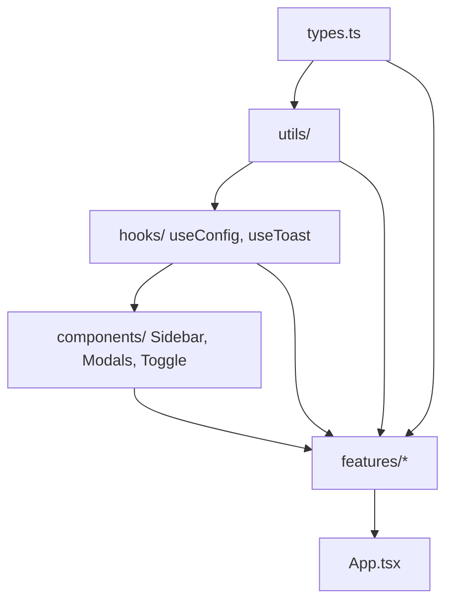
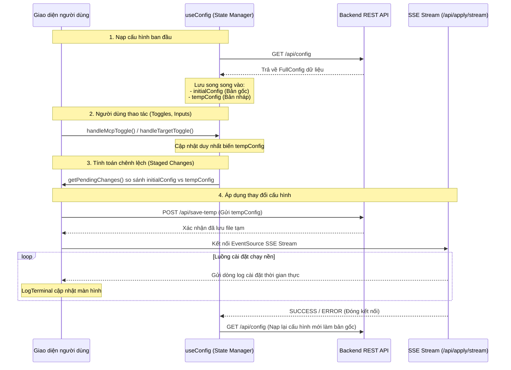

# PHÂN TÍCH CHUYÊN SÂU KIẾN TRÚC FRONTEND
## DỰ ÁN: AI AGENT CONFIGURATION ENGINE

Tài liệu này cung cấp một nghiên cứu kỹ thuật chuyên sâu (deep-dive) về toàn bộ cấu trúc và các tính năng Frontend của dự án `ai-coding-config`. Cấu trúc của Frontend tuân thủ nghiêm ngặt mô hình **Feature-based React Architecture**, trong đó mã nguồn được tổ chức theo các miền nghiệp vụ (business domains) thay vì theo định dạng tệp tin.

---

## I. TỔNG QUAN KIẾN TRÚC & PHÂN BỔ DEPENDENCY

### 1. Công nghệ sử dụng
- **Framework Core:** React 19
- **Bundler & Build Tool:** Vite
- **Routing:** React Router v7 (sử dụng mô hình SPA dạng tab trong `App.tsx`)
- **Styling:** Tailwind CSS v4 & Vanilla CSS (sử dụng các hiệu ứng cao cấp như dark mode, glassmorphism, và micro-animations)
- **Icons:** Lucide React

### 2. Quy tắc luồng phụ thuộc (Dependency Flow)
Các thành phần của hệ thống được tổ chức thành 2 tầng phân tách rõ rệt:
- **Tầng Shared (`src/` top-level):** Gồm `components/` (các UI dùng chung như `Sidebar`, `Toast`, `Toggle`, `Modals`), `hooks/` (`useConfig`, `useToast`), `utils/` (`format`), và `types.ts`. Các thành phần này không được phép import ngược từ tầng Feature.
- **Tầng Features (`src/features/`):** Chứa 7 tính năng chính độc lập. Mỗi feature định nghĩa một Compound Component tại tệp `index.ts(x)` để làm API public duy nhất cho tầng ngoài (App) sử dụng. Các feature không được import chéo lẫn nhau (sideways).



---

## II. CHI TIẾT 7 FEATURES & SUB-COMPONENTS

Dưới đây là phân tích chi tiết của 7 tab giao diện tương ứng với 7 features được tích hợp trong hệ thống:

```
src/features/
├── analytics/        # Thống kê lượng token và chi phí
├── conversations/    # Observability chi tiết các bước chạy của Agent
├── dashboard/        # Giao diện chính hiển thị trạng thái tổng quan
├── explorer/         # Trình duyệt Agents và Custom Skills
├── graph/            # Trực quan hóa Codebase Graph qua Graphify
├── settings/         # Cấu hình tham số cho Claude, Codex, Gemini & MCP
└── simulator/        # Giả lập luồng bảo mật gọi công cụ (Tool Call Sandbox)
```

### 1. Dashboard (`dashboard`)
- **Tệp chính:** [DashboardTab.tsx](file://frontend/src/features/dashboard/components/DashboardTab/DashboardTab.tsx)
- **Vai trò:** Trung tâm điều khiển chính, hiển thị trạng thái hiện tại của toàn bộ cấu hình hệ thống và quá trình nạp cấu hình.
- **Các Sub-components tương ứng:**
  1. [GraphifyStatus.tsx](file://frontend/src/features/dashboard/components/GraphifyStatus/GraphifyStatus.tsx): Hiển thị trạng thái sức khỏe của Graphify Index. Nếu thiếu hoặc cũ (stale), nút **Rebuild Graph** sẽ kích hoạt yêu cầu POST đến `/api/graphify/rebuild` để lập chỉ mục lại mã nguồn.
  2. [TargetCards.tsx](file://frontend/src/features/dashboard/components/TargetCards/TargetCards.tsx): Biểu diễn tình trạng của 3 Target CLI chính (Claude Code, Codex CLI, Antigravity). Những target được chọn lưu tạm trong `tempConfig` sẽ được đánh dấu viền gradient lấp lánh (glass-gold).
  3. [StatsOverview.tsx](file://frontend/src/features/dashboard/components/StatsOverview/StatsOverview.tsx): Thống kê nhanh số lượng Agents, Skills và trạng thái hoạt động/vô hiệu hóa của các MCP Servers. Cho phép click để điều hướng nhanh sang các tab tương ứng.
  4. [AgentSkillLists.tsx](file://frontend/src/features/dashboard/components/AgentSkillLists/AgentSkillLists.tsx): Trích xuất 3 Agents và 3 Skills đầu tiên trong cấu hình để hiển thị danh sách dạng thẻ nhỏ, hỗ trợ click xem chi tiết.
  5. [LogTerminal.tsx](file://frontend/src/features/dashboard/components/LogTerminal/LogTerminal.tsx): Một cửa sổ dòng lệnh (Terminal) mô phỏng kiểu macOS. LogTerminal chuyển đổi mã màu ANSI (ANSI escape codes) thành các thẻ span HTML tương thích với Tailwind (đỏ, lục, lam, vàng...) để kết xuất văn bản trực tiếp từ luồng stream cài đặt hoặc build đồ thị.

### 2. Settings (`settings`)
- **Tệp chính:** [SettingsSection.tsx](file://frontend/src/features/settings/components/SettingsSection/SettingsSection.tsx)
- **Vai trò:** Cung cấp biểu mẫu chỉnh sửa trực quan cho từng công cụ CLI trợ lý ảo và thiết lập MCP Servers.
- **Các Sub-components tương ứng:**
  1. [McpTab.tsx](file://frontend/src/features/settings/components/McpTab/McpTab.tsx):
     - Quản lý danh sách MCP Server gồm máy chủ cốt lõi (Core) và máy chủ tùy chỉnh (Custom).
     - Cho phép chỉnh sửa giao thức kết nối: `stdio` (chạy command cục bộ) hoặc `sse` (kết nối endpoint).
     - Hỗ trợ công cụ **Test Diagnostics** qua endpoint `/api/mcp/test` để kiểm tra độ tin cậy của máy chủ trước khi lưu cấu hình.
  2. [ClaudeTab.tsx](file://frontend/src/features/settings/components/ClaudeTab/ClaudeTab.tsx):
     - Chỉnh sửa các biến môi trường cấu hình của Claude (`MAX_THINKING_TOKENS`, `CLAUDE_CODE_MAX_OUTPUT_TOKENS`, `CLAUDE_AUTOCOMPACT_PCT_OVERRIDE`, `CLAUDE_CODE_NO_FLICKER`).
     - Tích hợp cửa sổ soạn thảo (Modal) để biên tập tệp tin hướng dẫn hệ thống [CLAUDE.md](file://CLAUDE.md).
     - Thiết lập cơ chế phân quyền bảo mật mặc định (ask/allow) và bỏ qua cảnh báo chế độ nguy hiểm.
  3. [CodexTab.tsx](file://frontend/src/features/settings/components/CodexTab/CodexTab.tsx):
     - Cấu hình model AI, mức độ tư duy (`model_reasoning_effort`), tìm kiếm web (`web_search`), chính sách phê duyệt (`approval_policy`), cơ chế hộp cát (`sandbox_mode`) và các cài đặt bật tắt bộ nhớ (`memories`), đa tác nhân (`multi_agent`).
     - Tích hợp cửa sổ soạn thảo tệp tin cấu hình quy tắc [AGENTS.md](file://AGENTS.md).
  4. [GeminiTab.tsx](file://frontend/src/features/settings/components/GeminiTab/GeminiTab.tsx):
     - Định cấu hình cho Antigravity CLI bao gồm model alias, đo lường từ xa (telemetry), phân quyền công cụ (always-ask/always-proceed) và danh sách đường dẫn các thư mục tin cậy (`trustedWorkspaces`).
     - Biên tập hướng dẫn hệ thống cho Antigravity thông qua tệp [ANTIGRAVITY.md](file://ANTIGRAVITY.md).

### 3. Explorer (`explorer`)
- **Tệp chính:** [ExplorerTab.tsx](file://frontend/src/features/explorer/components/ExplorerTab/ExplorerTab.tsx)
- **Vai trò:** Trình duyệt nội dung hệ thống của toàn bộ trợ lý ảo và kỹ năng đang hoạt động trong dự án.
- **Tính năng chi tiết:**
  - Cung cấp thanh tìm kiếm và bộ lọc nhanh theo danh mục: All, Agents, Skills.
  - Khi người dùng chọn một mục, component kích hoạt request GET đến `/api/agent/<name>` hoặc `/api/skill/<name>` để lấy thông tin chi tiết.
  - Giải mã và hiển thị các trường mô tả, metadata (origin, model yêu cầu) và hệ thống prompt thô.
  - Sử dụng thư viện `marked` để biên dịch trực tiếp System Prompt từ định dạng Markdown sang HTML có cấu trúc đẹp mắt.

### 4. Conversations - Observability (`conversations`)
- **Tệp chính:** [ConversationViewer.tsx](file://frontend/src/features/conversations/components/ConversationViewer/ConversationViewer.tsx)
- **Vai trò:** Hệ thống giám sát hội thoại thời gian thực, cho phép phân tích hành vi gọi tool của AI trong các phiên hoạt động.
- **Các Sub-components tương ứng:**
  1. [ChatView.tsx](file://frontend/src/features/conversations/components/ChatView/ChatView.tsx): Kết xuất luồng tin nhắn giữa người dùng (You) và trợ lý ảo (Assistant) theo dạng bong bóng chat.
  2. [WorkspaceView.tsx](file://frontend/src/features/conversations/components/WorkspaceView/WorkspaceView.tsx):
     - Hiển thị luồng thực thi công cụ (**Tool Flow**).
     - Cung cấp bảng danh mục lượt hội thoại (**Turn Directory**), tự động vẽ chấm màu hiển thị loại tool được gọi trong lượt đó (Vàng: lệnh shell, Cam: sửa mã, Xanh lam: đọc file/grep, Xanh lục: MCP tool).
     - Render chi tiết từng thẻ công cụ (`ToolCard`) chứa: lý do AI quyết định gọi công cụ đó (AI Reasoning), các tham số đầu vào được giải mã từ JSON (Arguments), và hộp đầu ra kết quả thực thi (Output) với tính năng thu gọn/mở rộng trực quan.
  3. [TokenStats.tsx]: Hiển thị các khối đo lường tài nguyên tiêu hao theo lượt, bao gồm token đầu vào (Input), đầu ra (Output), và chi phí tài chính tương ứng ước lượng.

### 5. Code Graph (`graph`)
- **Tệp chính:** [GraphTab.tsx](file://frontend/src/features/graph/components/GraphTab/GraphTab.tsx)
- **Vai trò:** Giao diện tích hợp công cụ Graphify dùng để vẽ và phân tích sơ đồ cấu trúc của codebase.
- **Tính năng chi tiết:**
  - Nhúng trực tiếp tài nguyên đồ thị động thông qua thẻ `iframe` trỏ đến endpoint `/api/graphify/view?project=${project}&type=${viewType}`.
  - Hỗ trợ chọn nhanh dự án cần xem (`mswcc-front-fe` hoặc `ai-coding-config`).
  - Cho phép chuyển đổi 3 chế độ xem: **2D Network** (mạng lưới quan hệ), **Module Tree** (cây thư mục mô-đun), và **Call Flow** (luồng gọi phụ thuộc).
  - Tích hợp nút **Update Graph** gửi yêu cầu POST đến `/api/graphify/update` để phân tích nhanh AST (không dùng LLM) cập nhật sơ đồ ngay lập tức mà không làm treo hệ thống.

### 6. Simulator (`simulator`)
- **Tệp chính:** [SimulatorTab.tsx](file://frontend/src/features/simulator/components/SimulatorTab/SimulatorTab.tsx)
- **Vai trò:** Công cụ mô phỏng trực quan quy trình gọi công cụ và hộp cát bảo mật của AI (Tool Calling Sandbox).
- **Tính năng chi tiết:**
  - **Chế độ Mô phỏng (Sim):** Trình diễn dòng chảy dữ liệu hoàn toàn giả lập, cung cấp log chi tiết của các lớp bảo mật.
  - **Chế độ Thực tế (Real):** Kết nối trực tiếp với backend qua endpoint `/api/simulator/execute` để chạy lệnh thật trên máy thật của người dùng.
  - **Kịch bản rủi ro thấp (Low Risk):** Đọc nội dung file (view_file). Thực hiện tự động ngay khi AI yêu cầu thông qua quyền đọc của hệ điều hành.
  - **Kịch bản rủi ro cao (High Risk):** Chạy lệnh Shell ghi/thực thi (run_command). CLI sẽ kích hoạt **Chốt chặn duyệt tay (Layer 4: Consent Gate)** hiển thị hộp thoại cảnh báo để người dùng click **Approve** (Đồng ý chạy) hoặc **Reject** (Từ chối).
  - **Cảnh báo bảo mật vật lý:** Phân tích sự nguy hại của thư mục lưu trữ thông tin nhạy cảm cục bộ `~/.claude/` (chứa API key dạng text thô) và đưa ra hướng dẫn cấp quyền hệ thống (`chmod 700`, `chmod 600`).

### 7. Analytics (`analytics`)
- **Tệp chính:** [AnalyticsTab.tsx](file://frontend/src/features/analytics/components/AnalyticsTab/AnalyticsTab.tsx)
- **Vai trò:** Nạp dữ liệu từ `/api/analytics` để tổng hợp số liệu hiệu suất hoạt động, mức sử dụng tài nguyên và định giá chi phí.
- **Tính năng chi tiết:**
  - Tổng hợp 6 chỉ số cốt lõi: Sessions, Total Steps, User Turns, Input Tokens, Output Tokens, Total Cost.
  - **Phân tích đòn bẩy chi phí (Cost Leverage):** So sánh giá thực tế chạy trên Gemini 3.5 Flash với mức giá ước tính của Gemini 3.5 Pro để tính toán số tiền tiết kiệm được ($ và %).
  - **Biểu đồ phân phối token (Token Volume):** Hiển thị thị phần tiêu thụ token của 3 trợ lý ảo (Gemini, Claude, Codex) theo phần trăm.
  - **Bảng lịch sử phiên (Session History Directory):** Liệt kê chi tiết toàn bộ các phiên gỡ lỗi trong quá khứ, hỗ trợ tìm kiếm, lọc theo nguồn và click trực tiếp để nhảy sang màn hình Observability tương ứng.

---

## III. QUẢN LÝ STATE & LUỒNG DỮ LIỆU CHÍNH (DATA FLOW)

Kiến trúc không phụ thuộc vào các thư viện quản lý state bên thứ ba như Zustand hay Redux. Thay vào đó, toàn bộ state toàn cục của cấu hình được duy trì qua các React State nguyên bản kết hợp với Custom Hooks để đảm bảo hiệu suất tốt nhất và sự tối giản tối đa.



### 1. Cơ chế Staged Changes (Lớp lưu nháp)
Cơ chế này sử dụng song song hai biến state trong custom hook [useConfig.ts](file://frontend/src/hooks/useConfig.ts):
- `initialConfig`: Lưu trữ trạng thái cấu hình chuẩn trên ổ đĩa backend lúc vừa nạp trang.
- `tempConfig`: Bản sao sâu (deep copy) của cấu hình. Mọi thao tác bật tắt target, bật tắt MCP, chỉnh sửa biến môi trường của người dùng đều chỉ tác động lên `tempConfig`.

Hàm `getPendingChanges()` liên tục chạy để so khớp từng thuộc tính giữa hai cấu hình trên và xuất ra danh sách các thay đổi chưa được áp dụng:
- Bật/tắt CLI Target: Sinh loại thay đổi `add`/`remove` cho các target.
- Trạng thái MCP Server: So sánh thuộc tính kích hoạt và nội dung cấu hình chi tiết của từng server.
- Các tham số cấu hình riêng: So sánh các giá trị biến môi trường của Claude, Codex và Gemini.
- Sự thay đổi tệp hướng dẫn: Phát hiện xem các tệp `CLAUDE.md`, `AGENTS.md` hay `ANTIGRAVITY.md` có bị chỉnh sửa nội dung hay không.

### 2. Luồng đồng bộ SSE (Server-Sent Events)
Khi bấm **Apply Changes**, hệ thống kích hoạt luồng đồng bộ phức tạp:
1. Gửi yêu cầu POST chứa toàn bộ `tempConfig` hiện tại lên `/api/save-temp` để lưu trữ dữ liệu vào các tệp cấu hình tạm của backend.
2. Khởi tạo đối tượng `EventSource` kết nối đến endpoint SSE `/api/apply/stream?force=...&claude=...&codex=...&agy=...`.
3. Backend tiến hành chạy mã cài đặt, cài đặt các CLI và ghi đè cấu hình thật. Đồng thời, toàn bộ log kết quả được đẩy liên tục về UI.
4. `App.tsx` lắng nghe sự kiện, nối thêm các chuỗi văn bản mới nhận vào state `logs` và chuyển tới cho `LogTerminal` hiển thị trực tiếp lên giao diện.
5. Khi nhận được dòng text chứa `"SUCCESS:"` hoặc `"ERROR:"`, luồng SSE tự động đóng lại, và hệ thống gọi lại hàm `fetchConfig()` để đồng bộ lại dữ liệu gốc từ máy chủ, làm mới `initialConfig` và reset `tempConfig`.

---

## IV. TƯƠNG TÁC GIỮA SIDEBAR, MODALS VÀ CẤU HÌNH DỰ ÁN

Các cấu phần giao diện dùng chung tương tác chặt chẽ với cấu hình dự án thông qua cơ chế truyền callbacks (props down, events up) từ gốc `App.tsx`:

| Thành phần | Vai trò tương tác cấu hình | Cách thức triển khai kỹ thuật |
| :--- | :--- | :--- |
| **Sidebar** | Bật tắt nhanh các Target CLI, bật tắt nhanh máy chủ MCP, và hiển thị danh sách Diffs. | - Nhận `tempConfig` để đồng bộ UI của các nút Toggle.<br/>- Nhận hàm `handleTargetToggle` và `handleMcpToggle` để thay đổi nháp cấu hình.<br/>- Đọc trực tiếp danh sách mảng trả về từ `getPendingChanges()` để render vùng "Staged Changes" trực quan theo thời gian thực. |
| **AddMcpModal** | Thêm mới một máy chủ MCP tùy chỉnh vào cấu hình. | - Liên kết trực tiếp với các state tạm trong hook `useMcpForm` (`newMcpName`, `newMcpType`...).<br/>- Khi nhấn "Add Server", gọi hàm `addCustomMcp` để gộp bản ghi mới vào trường `mcp_servers` của `tempConfig` và tự động hiển thị trên khung cài đặt McpTab. |
| **ApplyModal** | Xác nhận ghi cấu hình nháp vào file thật của dự án. | - Cung cấp hai nút bấm kích hoạt tiến trình cài đặt trên hệ thống:<br/>  1. **Standard Apply:** Gọi hàm `executeApply` với tham số `force = false`. Sử dụng cơ chế ghi cấu hình và chạy cài đặt thông thường.<br/>  1. **Force Overwrite:** Gọi hàm `executeApply` với tham số `force = true`. Ghi đè toàn bộ cấu hình đích bất kể xung đột. |
| **DiscardModal**| Hủy toàn bộ thay đổi nháp đang stage. | - Khi nhấn xác nhận, gọi hàm `executeDiscard` để thực thi sao chép ghi đè cấu hình `initialConfig` gốc vào `tempConfig`, đưa toàn bộ các nút Toggle và Input về giá trị ban đầu và xóa sạch vùng staged changes ở Sidebar. |

---

## V. TỔNG KẾT & ĐÁNH GIÁ CHẤT LƯỢNG UI/UX

Kiến trúc frontend của dự án `ai-coding-config` thể hiện các tiêu chuẩn phát triển phần mềm chất lượng cao nhờ những điểm sáng sau:
1. **Kiến trúc rõ ràng:** Tuân thủ tuyệt đối quy tắc Feature-based React Architecture giúp cô lập tốt các module nghiệp vụ. Bất cứ thay đổi nào ở feature `simulator` hay `conversations` đều không làm ảnh hưởng đến các vùng cấu hình cốt lõi.
2. **Cơ chế lưu nháp an toàn:** Khái niệm tách biệt giữa `initialConfig` và `tempConfig` giúp người dùng tự do thử nghiệm bật/tắt hàng loạt cấu hình MCP hoặc viết thử quy tắc hướng dẫn mà không sợ làm hỏng file cấu hình hệ thống thật cho đến khi họ bấm duyệt Apply.
3. **Trải nghiệm người dùng phong phú (Rich Aesthetics):** Giao diện đáp ứng tốt các nguyên tắc thiết kế hiện đại như:
   - Các hiệu ứng chuyển động mượt mà bằng CSS và Tailwind.
   - Trực quan hóa dữ liệu tốt (chấm tròn chỉ thị màu cho từng nhóm công cụ trong hội thoại, bảng biểu so sánh trực quan chi phí).
   - Tích hợp trình giả lập Sandbox và trình trực quan hóa Codebase Graph trực tiếp trong ứng dụng.
