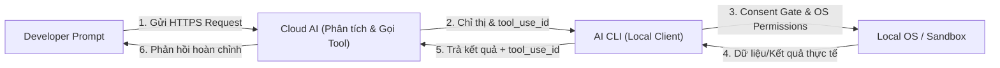

# Tool Calling Security Model
## A Deep Dive into AI CLI Agent Architecture (Claude Code, Codex CLI, Aider, etc.)

This document outlines the security architecture and threat model of local AI Coding Agent CLIs. These agents communicate with cloud-hosted Large Language Models (LLMs) but execute code and terminal commands locally on your host operating system.

---

### 🔄 Luồng chạy 7 bước của AI CLI (Bắt đầu từ bạn -> Cloud -> Máy bạn -> Trả về)

1. **Bạn hỏi**: Bạn gõ *"Đọc file App.tsx giúp tôi"* vào terminal.
2. **Gửi lên Cloud (Lớp 1 - API Key)**: **AI CLI** gửi yêu cầu lên AI trên Cloud kèm theo **API Key** (xác thực danh tính) để kiểm tra tài khoản, hạn mức và quyền sử dụng Model.
3. **AI ra chỉ thị (Lớp 2 - `tool_use_id`)**: AI nhận ra cần dùng công cụ đọc file. Nó tạo ra một chỉ thị: *"Hãy đọc file App.tsx"*, đóng dấu mã số phong bì là **`tool_use_id: 123`** rồi gửi ngược về máy bạn.
4. **Định tuyến an toàn (Lớp 4 - Consent Gate)**: **AI CLI** dưới máy nhận tờ chỉ thị. Nếu chỉ thị thuộc nhóm nguy hiểm (như xóa file, chạy script), nó sẽ **dừng lại** hỏi bạn duyệt (`y/N`). Đọc file là an toàn nên nó sẽ tự động chạy.
5. **Thực thi lệnh (Lớp 3 & Lớp 5 - OS & Sandbox)**: **AI CLI** dùng chính **quyền người dùng của bạn trên máy (OS Permission)** để thực thi công việc. Nếu cấu hình chạy trong **Docker (Sandbox)**, nó sẽ thực thi an toàn trong container để tránh làm ảnh hưởng đến máy thật.
6. **Đóng gói kết quả (Lớp 2 - So khớp ID)**: Đọc xong code, **AI CLI** đóng gói nội dung file, dán nhãn đúng mã số **`tool_use_id: 123`** rồi gửi kết quả trả lại Cloud.
7. **AI phản hồi**: AI trên Cloud nhận lại phong bì, so khớp đúng mã số `123` của yêu cầu trước đó, đọc nội dung code nhận được để phân tích và trả về câu trả lời hoàn chỉnh hiển thị lên màn hình cho bạn qua **AI CLI**.

---

### ⚠️ Điểm yếu vật lý ở máy bạn (Lớp 6 - Local Secrets)
Tất cả API Key, cấu hình và lịch sử chat này được lưu dạng **chữ thường (plaintext)** trong thư mục cấu hình cục bộ (ví dụ: `~/.claude/`, `~/.codex/`) trên máy bạn. Nếu máy bạn bị dính mã độc từ một phần mềm hoặc thư viện khác, kẻ tấn công chỉ cần vào thư mục này là có thể đọc trọn API Key và lịch sử code của bạn mà không cần xâm nhập từ xa.

---

### Sơ đồ luồng hoạt động đơn giản (Simple Flow Diagram)



---

## The 6-Layer Security Model

The security posture of an AI CLI agent is composed of six distinct layers, separating cloud-based authorization from local execution boundaries.

---

### Layer 1: API Credentials (Authentication & Authorization)
AI CLIs do not just "compare string keys" locally. The credentials (API Key or OAuth Bearer Token) are sent in the HTTPS headers of every request to the cloud provider (e.g., Anthropic, OpenAI, Google).

* **Purpose**: Identity and account validation.
* **Key functions determined on the Cloud Provider side**:
  * **Authentication**: Verifying who is making the request.
  * **Authorization**: Determining which models the client is permitted to call.
  * **Rate Limits**: Applying rate-limiting policies corresponding to the account tier.
  * **Billing & Quota**: Computing cost per token and deducting from the account balance.

---

### Layer 2: `tool_use_id` (Correlation & State Integrity)
A common misconception in Tool Calling literature is that `tool_use_id` acts as an access token or an anti-forgery credential. In reality, it is a **Correlation Identifier** (or Request-Response Matcher).

```text
[Cloud Model]  --- tool_use (id: "toolu_123", name: "read_file") --->  [Local CLI Client]
                                                                               |
                                                                        (Reads File)
                                                                               |
[Cloud Model]  <-- tool_result (tool_use_id: "toolu_123", content) --  [Local CLI Client]
```

* **Purpose**: Conversation State Integrity.
* **Mechanisms**:
  * The cloud model generates a unique `tool_use_id` (e.g., `toolu_123`) when requesting a tool call.
  * The local CLI client must return the result mapped to that exact `tool_use_id` in the next message.
  * If the IDs do not match (e.g., Tool Use A but Tool Result B), the API server rejects the request because it cannot construct a valid sequential conversation history.
  * **Security Value**: While not an authentication credential, it prevents out-of-context payload injection. For example, if an attacker attempts to inject a malicious string (like `Database password = admin`) into the pipeline, the server will ignore or reject it unless it is wrapped in a valid, active `tool_use_id` currently expected by the model.

---

### Layer 3: OS Permissions & Privilege Inheritance
From the host operating system's perspective, the AI agent is not "special". It is simply a local process running under the user's active session.

* **Purpose**: Local boundary execution.
* **Mechanisms**:
  * The CLI process inherits the user's active **UID (User ID)** on Linux/macOS or **User Token** on Windows.
  * The agent possesses the exact same read, write, and execute permissions as the developer running the command.
  * If the developer has write access to the project source, read access to `~/.ssh/id_rsa`, or permission to execute `rm -rf /`, **so does the AI agent**.
  * **Risk**: If the agent hallucinates or is prompted to run destructive commands, it can modify or delete files directly in the host OS.

---

### Layer 4: Consent Gates (Human-in-the-Loop)
Because local process execution inherits all user privileges, CLI clients implement interactive gates for dangerous or write operations.

* **Purpose**: Human authorization of high-risk actions.
* **Mechanisms**:
  * Low-risk tools (e.g., `view_file` to read read-only code) run automatically to maintain a fast developer flow.
  * High-risk tools (e.g., `run_command` to execute terminal scripts, `replace_file_content` to make modifications, or git actions) trigger a terminal prompt asking the user for confirmation (`[y/N]`).
  * **Caveat**: Consent Gates can be bypassed entirely via startup flags (e.g., `claude --dangerously-skip-permissions` or `codex --full-auto`). When the consent layer is set to 0, the system relies entirely on Layer 3 (OS Permissions) and Layer 5 (Sandboxing) for safety.

---

### Layer 5: Sandbox / Isolation (Blast Radius Controller)
When Consent Gates are turned off, or when developers approve commands without reviewing them carefully, sandboxing acts as the primary defense boundary.

* **Purpose**: Containment and limiting the blast radius of destructive actions.
* **Mechanisms**:
  * Running the AI CLI agent inside lightweight isolation systems (e.g., **Docker containers**, **Firecracker microVMs**, **WSL (Windows Subsystem for Linux)**, or standard virtual machines).
  * In a sandboxed state, even if the agent executes `rm -rf /` or gets compromised, the damage is restricted to the containerized environment and cannot corrupt the host operating system or steal host credentials.

---

### Layer 6: Local Config & Secrets Leakage
A frequently overlooked risk in AI CLI tooling is the local configuration directory (e.g., `~/.claude/`, `~/.config/claude/`, `~/.codex/`).

* **Purpose**: Local state management and conversation history.
* **Vulnerabilities**:
  * These directories store API keys, OAuth session tokens, cached logs, conversation history (`.jsonl` files), and MCP configurations in plain text.
  * **Risk Vector**: If the developer's machine is compromised by local malware (such as a malicious dependency in another project), the attacker can easily read the plain text configuration files inside `~/.claude/` to steal Anthropic/OpenAI credentials or extract proprietary code from the cached chat logs.

---

## Security Best Practices for AI CLI Execution

To secure local AI agent execution, developers should implement the following mitigations:

1. **Harden Local Directory Permissions**:
   Restrict read/write permissions to the configuration directory so only your user process can access it:
   ```bash
   chmod 700 ~/.claude
   chmod 600 ~/.claude.json
   ```
2. **Execute in Containerized Environments**:
   For untrusted workspaces or complex refactors, run the CLI inside a Docker container:
   ```bash
   docker run -it -v $(pwd):/workspace -w /workspace node:18-slim npx @anthropic-ai/claude-code
   ```
3. **Audit Before Approval**:
   Treat the Consent Gate seriously. Carefully read the proposed commands, file writes, and network operations before pressing `y`.
4. **Use Scoped API Keys**:
   When using custom API keys, configure them with specific spend limits and project scope to minimize financial and access exposure if leaked.
