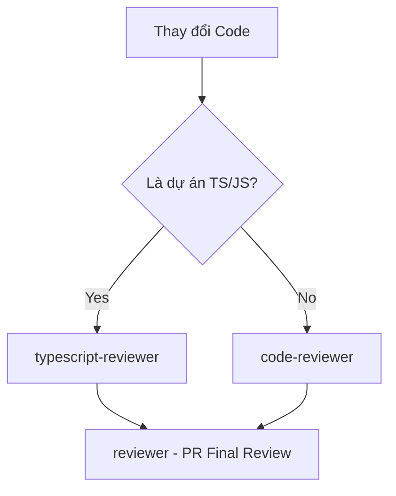

# Báo cáo Phân tích Context Budget & Ranh giới Hoạt động (Domain Boundaries)

> [!NOTE]
> Báo cáo này là một kiểm tra tại thời điểm nhất định (**Point-in-Time Audit**). Trạng thái của các MCP Server có thể thay đổi động bằng script `mcp-toggle.py`. Hãy chạy `python3 scripts/mcp-toggle.py list` để cập nhật trạng thái thực tế mới nhất.

Báo cáo này rà soát toàn bộ tài nguyên (MCP, Skills, Subagents) hiện có trong dự án, xác định các thành phần có nguy cơ chồng chéo hoặc gọi trùng lặp (double-calling) gây lãng phí dung lượng context (token budget), từ đó đề xuất các ranh giới hoạt động và tối ưu hóa cụ thể.

---

## 1. Kiểm tra MCP Servers (Overhead: ~17,500 tokens)

Dựa trên kết quả từ `scripts/mcp-toggle.py`, trạng thái hoạt động của các MCP Server như sau:

| MCP Server | Trạng thái gốc | Số lượng Tool | Ước lượng Token* | Nhận xét & Đề xuất Tối ưu |
| :--- | :---: | :---: | :---: | :--- |
| **playwright** | ✔ Kích hoạt | 23 | ~11,500 | **Overhead rất lớn**. Playwright định nghĩa 23 schema chi tiết cho trình duyệt. Chỉ nên kích hoạt khi thực hiện E2E testing hoặc kiểm tra giao diện trực quan (visual audit). *(Trạng thái hiện tại sau tối ưu: ✘ Đã tắt)*. |
| **memory** | ✔ Kích hoạt | 9 | ~4,500 | Hữu ích cho các session dài hơi để ghi nhớ cấu trúc graph và tránh lặp lại lịch sử. **Khuyến nghị**: Chỉ nên tắt đối với các tác vụ nhỏ, cô lập (`isolated small tasks`), không tắt mặc định. |
| **context7** | ✔ Kích hoạt | 2 | ~1,000 | Tác vụ tra cứu tài liệu thư viện. OK (Luôn mở). |
| **sequential-thinking** | ✔ Kích hoạt | 1 | ~500 | Hỗ trợ phân tích logic tuyến tính. OK (Luôn mở). |
| **postgres, sqlite, docker, aws** | ✘ Đã tắt | 0 | 0 | **Tối ưu tốt**. Các mcp này đã được cấu hình tắt mặc định và chỉ bật thủ công khi cần. |

*\*Lưu ý: Các con số token ở trên là ước lượng xấp xỉ dựa trên số lượng và kích thước schema của công cụ, không phải con số tuyệt đối cho mọi phiên làm việc.*

> [!TIP]
> **Đề xuất Tối ưu**: Khi không thực hiện E2E hoặc kiểm tra UI, hãy tắt Playwright MCP bằng lệnh:
> `rtk python3 scripts/mcp-toggle.py disable playwright`
> Và chạy `python3 scripts/mcp-toggle.py list` để refresh lại danh sách.

---

## 2. Phân định Ranh giới các Skill (Domain Boundaries)

Với 28 skills hiện có, một số nhóm skill thuộc các domain tương đồng dễ bị kích hoạt đồng thời hoặc lặp lại chỉ dẫn:

### Nhóm 1: Kiểm thử & Xác minh (Testing & Verification)
* **Các skill liên quan**: `tdd-workflow`, `verification-loop`, `eval-harness`.
* **Phân định ranh giới (Boundaries)**:
  * **`tdd-workflow`** (Phase phát triển): Áp dụng trong suốt quá trình phát triển logic mới theo chu kỳ RED-GREEN-REFACTOR.
  * **`verification-loop`** (Phase hoàn thiện): Là lưới lọc tổng quát cuối cùng (chạy build, linter, typecheck) trước khi hoàn thành task.
  * **`eval-harness`**: Chỉ sử dụng nội bộ khi chạy các chương trình chấm điểm tự động (evaluations) để đo lường hiệu suất của tác nhân.
* **Quy tắc tránh trùng lặp**: Cả hai đều có thể sử dụng trong cùng một task lớn nhưng ở các giai đoạn (phases) khác nhau, tránh gọi đồng thời trong cùng một phản hồi để tiết kiệm context.

### Nhóm 2: Giao diện & Design System (Frontend UI/UX)
* **Các skill liên quan**: `frontend-design`, `design-system`, `frontend-patterns`.
* **Phân định ranh giới (Boundaries)**:
  * **`design-system`**: Chứa các token tĩnh (spacing, typography, CSS variables, màu sắc). Dùng để tra cứu hoặc kiểm tra tính nhất quán về mặt kỹ thuật của CSS.
  * **`frontend-design`**: Định hướng triết lý thẩm mỹ nghệ thuật (Brutalist, Editorial, Minimal) và trải nghiệm người dùng cao cấp. Dùng để quyết định phong cách giao diện tổng thể.
  * **`frontend-patterns`**: Chỉ dẫn cấu trúc code React/NextJS (state management, component composition, hooks).
* **Quy tắc tránh trùng lặp**: Tránh việc lồng ghép toàn bộ nội dung của `design-system` vào `frontend-design`. Khi thiết kế UI, hãy gọi `frontend-design` để định hình style, sau đó dùng `design-system` làm bảng tham chiếu thông số kỹ thuật.

### Nhóm 3: REST API & Backend
* **Các skill liên quan**: `api-design`, `backend-patterns`, `next-best-practices`.
* **Phân định ranh giới (Boundaries)**:
  * **`api-design`**: Chỉ quản lý thiết kế hợp đồng HTTP (naming, endpoints, HTTP methods, status codes, pagination).
  * **`backend-patterns`**: Quản lý logic xử lý phía server (DB query optimization, caching, error handling).
  * **`next-best-practices`**: Chỉ dành riêng cho các quy ước và tối ưu hóa của Next.js (RSC boundaries, Server Actions).

---

## 3. Phân định Ranh giới Subagents (Specialized Agents)

Trong số 13 agent được biên dịch, nhóm Code Review có sự phân định ranh giới hoạt động rõ ràng để tránh lãng phí:

### Ranh giới hoạt động chi tiết của nhóm Review:

1. **`typescript-reviewer`** vs **`code-reviewer`**:
   * **`typescript-reviewer`**: Dành cho các thay đổi liên quan đến file TypeScript/JavaScript (`.ts`, `.tsx`, `.js`, `.jsx`). Nó đã bao hàm các kiểm tra chất lượng code cơ bản cộng thêm phân tích kiểu dữ liệu (type safety), bất đồng bộ (async), và tsconfig.
   * **`code-reviewer`**: Dùng cho các ngôn ngữ khác (Python, Go, Configs, Shell scripts) hoặc các đợt tái cấu trúc kiến trúc chung không đặc thù cho ngôn ngữ.
   * **Quy tắc tối ưu**: Tránh gọi song song cả hai cho cùng một file thay đổi. Với dự án thuần TS/JS, chỉ gọi `typescript-reviewer`. Với dự án phi TS/JS, chỉ gọi `code-reviewer`.
   * **Ngoại lệ cho Mixed-Stack**: Đối với các PR hỗn hợp (sửa cả TS/JS và Python/Backend configs), có thể kích hoạt cả hai agent review nhưng giới hạn phạm vi (scope) kiểm tra riêng biệt cho từng domain cụ thể.

2. **`reviewer`** (PR Review):
   * Chỉ kích hoạt ở bước cuối cùng trước khi tạo Pull Request để kiểm tra tính toàn vẹn tổng thể (behavioral correctness, security, thiếu test) và đưa ra phán quyết (`APPROVE | WARNING | BLOCK`).
   * Không dùng `reviewer` trong quá trình code hoặc sửa lỗi nhỏ từng file (khi đó nên dùng `typescript-reviewer` hoặc `code-reviewer` để kiểm tra nhanh).

3. **`planner`** vs **`architect`**:
   * **`architect`**: Thực hiện nghiên cứu, chọn lựa công nghệ, định hình schema cơ sở dữ liệu và các ranh giới module (architectural boundaries) **trước khi** lập kế hoạch chi tiết.
   * **`planner`**: Nhận kiến trúc đã được chốt từ `architect` để chia nhỏ thành các bước triển khai cụ thể, lập danh sách tệp cần tạo/sửa.

---

## 4. Bảng Tổng kết Token Budget & Tiết kiệm Dự kiến

| Thành phần | Loại | Est. Tokens | Trạng thái / Khuyến nghị |
| :--- | :--- | :---: | :--- |
| **playwright** | MCP | ~11,500 | Tạm tắt khi không audit UI/E2E (Tiết kiệm ~11,500 tokens) |
| **memory** | MCP | ~4,500 | Bật mặc định; chỉ tắt cho các tác vụ nhỏ, cô lập. |
| **context-budget** | Skill | ~1,200 | OK - Tải theo nhu cầu (On-demand) |
| **typescript-reviewer** | Agent | ~1,800 | Chỉ gọi cho dự án TS/JS, bỏ qua `code-reviewer` |
| **code-reviewer** | Agent | ~4,500 | Chỉ gọi cho dự án phi TS/JS, bỏ qua `typescript-reviewer` |
| **reviewer** | Agent | ~300 | Chỉ gọi ở bước PR Final Review |

### Báo cáo Tiết kiệm Token (Token Savings Summary)
* **Tổng lượng overhead tối đa hiện tại**: **~27,000 tokens** (khi load toàn bộ MCP hoạt động và spawn song song nhiều agent review).
* **Sau khi áp dụng ranh giới và tối ưu hóa**: **~6,500 tokens** (tắt Playwright khi không cần thiết, chọn lọc duy nhất 1 agent review phù hợp).
* **Dung lượng context thu hồi được (Headroom gained)**: **~20,500 tokens** (tương đương tiết kiệm **~75.9%** tài nguyên context lãng phí).
