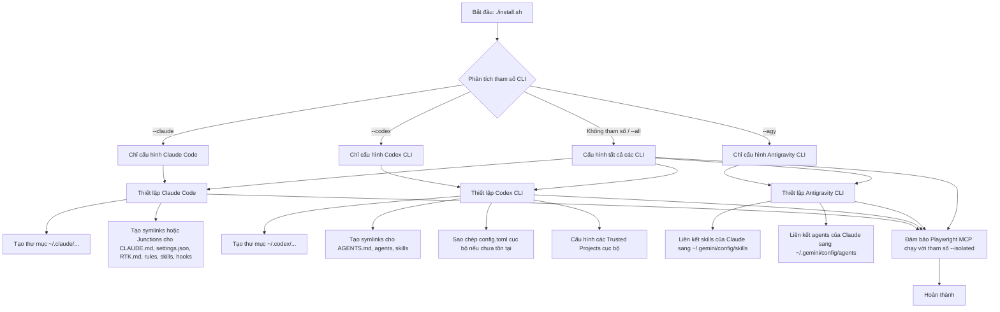

# Hướng dẫn Onboarding: Cấu hình AI Coding (Claude, Codex, agy)

Tài liệu này cung cấp hướng dẫn chi tiết về cấu trúc thư mục, luồng hoạt động của trình cài đặt (`install.sh`), và cách thức quản lý, cấu hình các tài nguyên dùng chung cho ba công cụ CLI mã nguồn mở/AI: **Claude Code**, **Codex CLI**, và **Antigravity CLI (agy)**.

---

## 📂 1. Cấu Trúc Thư Mục Dự Án

Dự án này là trung tâm cấu hình tập trung (source of truth) cho các AI Assistant khác nhau. Mọi thay đổi cấu hình nên được thực hiện tại đây và đồng bộ hóa ra hệ thống thông qua trình cài đặt.

```
ai-coding-config/
├── .playwright-mcp/      # Cấu hình độc lập cho Playwright MCP
├── claude/               # Cấu hình cho Claude Code
│   ├── agents/           # Các Custom Agents dạng file Markdown (.md)
│   ├── rules/            # Quy tắc coding standards (ví dụ: ECC rules)
│   │   └── ecc/          # 12 file quy tắc của bộ tiêu chuẩn ECC
│   ├── skills/           # Các kỹ năng nâng cao (bao gồm kịch bản và mã nguồn)
│   ├── hooks/            # Chứa các hooks (Pre/Post tool hooks) - được theo dõi qua .gitkeep
│   ├── CLAUDE.md         # Tài liệu chỉ dẫn đặc thù cho Claude Code
│   ├── RTK.md            # Tài liệu tham chiếu tối ưu hóa token cho Claude
│   └── settings.json     # Cấu hình hệ thống (bao gồm danh sách MCP servers)
├── codex/                # Cấu hình cho Codex CLI
│   ├── agents/           # Custom Agents dạng file TOML (.toml)
│   ├── AGENTS.md         # Tài liệu chỉ dẫn agents
│   ├── RTK.md            # Tài liệu tham chiếu tối ưu hóa token cho Codex
│   └── config.toml       # Mẫu cấu hình gốc của Codex (bao gồm mcpServers)
├── install.sh            # Script cài đặt/đồng bộ chính (Bash/Linux/Git Bash)
├── install.bat           # Wrapper chạy install.sh trên Windows CMD/PowerShell
├── README.md             # Tài liệu giới thiệu tổng quan dự án
└── onboarding_guide.md   # Hướng dẫn này
```

---

## ⚙️ 2. Luồng Hoạt Động của Trình Cài Đặt (`install.sh`)

Script cài đặt hỗ trợ cài đặt toàn bộ hoặc lựa chọn từng CLI cụ thể.



### Các bước xử lý chi tiết trong `link_path`:
1. **Kiểm tra OS**: Xác định môi trường là Linux hay Windows (Git Bash).
2. **Xử lý mục tiêu cũ**: Nếu tệp tin/thư mục đích đã tồn tại, script sẽ sao lưu tự động (thêm hậu tố `.bak.<timestamp>`) để tránh mất cấu hình riêng của người dùng.
3. **Liên kết trên Windows (Directory Junctions)**:
   - Sử dụng `cmd.exe /c mklink /j` cho thư mục để tạo **Directory Junctions**. Điều này giúp cài đặt thành công trên Windows mà **không cần quyền Administrator hay chế độ Developer Mode**.
   - Nếu liên kết thất bại, script tự động chuyển sang chế độ copy (`cp -R`) để đảm bảo không lỗi luồng cài đặt.
4. **Liên kết trên Linux**: Sử dụng liên kết mềm tiêu chuẩn (`ln -s`).

---

## 🛠️ 3. Hướng Dẫn Sử Dụng và Các Tác Vụ Chung

### Đồng bộ hóa cấu hình
Mỗi khi bạn cập nhật hoặc thêm mới các Agent, Skill hoặc Rule trong repository này, hãy chạy lệnh sau để cập nhật cấu hình trên máy của bạn:

*   **Linux / Git Bash:**
    ```bash
    ./install.sh
    ```
*   **Windows CMD / PowerShell:**
    ```cmd
    install.bat
    ```

### Chỉ cài đặt cấu hình cho một CLI nhất định
*   Chỉ cấu hình Claude: `./install.sh --claude`
*   Chỉ cấu hình Codex: `./install.sh --codex`
*   Chỉ cấu hình agy (Antigravity): `./install.sh --agy`

### Cơ chế độc lập Playwright (--isolated)
Playwright MCP server được tự động cấu hình thêm flag `--isolated`. Điều này ngăn chặn lỗi tranh chấp profile trình duyệt (`Browser is already in use`) khi bạn sử dụng đồng thời nhiều CLI.
